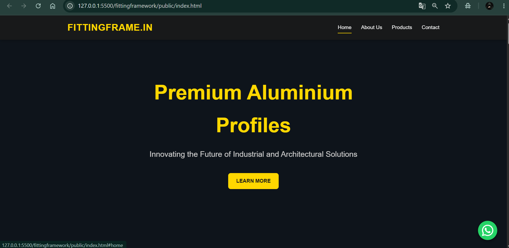

# Fitting Framework

A modern and responsive website built using Node.js, Express.js, HTML, CSS, and JavaScript. The project showcases premium aluminium profile solutions for industrial and architectural applications.

---
## Project Preview



## Features

- Responsive and modern UI
- Hero section with background image
- Product showcase pages
- About Us section
- Contact section
- Express.js backend server
- Dockerized application deployment

---

## Tech Stack

### Frontend
- HTML5
- CSS3
- JavaScript

### Backend
- Node.js
- Express.js

### DevOps
- Docker
- Git & GitHub

---

## Project Structure

```text
fittingframework/
│
├── public/
│   ├── css/
│   │   └── style.css
│   ├── js/
│   ├── images/
│   ├── index.html
│   ├── about.html
│   ├── products.html
│   └── contact.html
│
├── server.js
├── package.json
├── package-lock.json
├── Dockerfile
└── README.md
```

---

## Getting Started

### Clone the Repository

```bash
git clone https://github.com/pushpendra-singh1176/fittingframework.git
cd fittingframework
```

### Install Dependencies

```bash
npm install
```

### Start the Application

```bash
node server.js
```

The application will be available at:

```text
http://localhost:3000
```

---

## Running with Docker

### Build Docker Image

```bash
docker build -t fittingframework:v1 .
```

### Run Docker Container

```bash
docker run -d -p 3000:3000 --name fittingframework-app fittingframework:v1
```

Open the application:

```text
http://localhost:3000
```

---

## Docker Commands

### View Running Containers

```bash
docker ps
```

### Stop Container

```bash
docker stop fittingframework-app
```

### Remove Container

```bash
docker rm fittingframework-app
```

### Remove Image

```bash
docker rmi fittingframework:v1
```

---

## Future Enhancements

- Kubernetes Deployment
- CI/CD Pipeline Integration
- Nginx Reverse Proxy
- HTTPS Support
- Cloud Deployment (AWS)

---

## Author

**Pushpendra Singh**

B.Tech (Computer Science)

DevOps Enthusiast

GitHub: https://github.com/pushpendra-singh1176

---

## License

This project is created for learning and portfolio purposes.